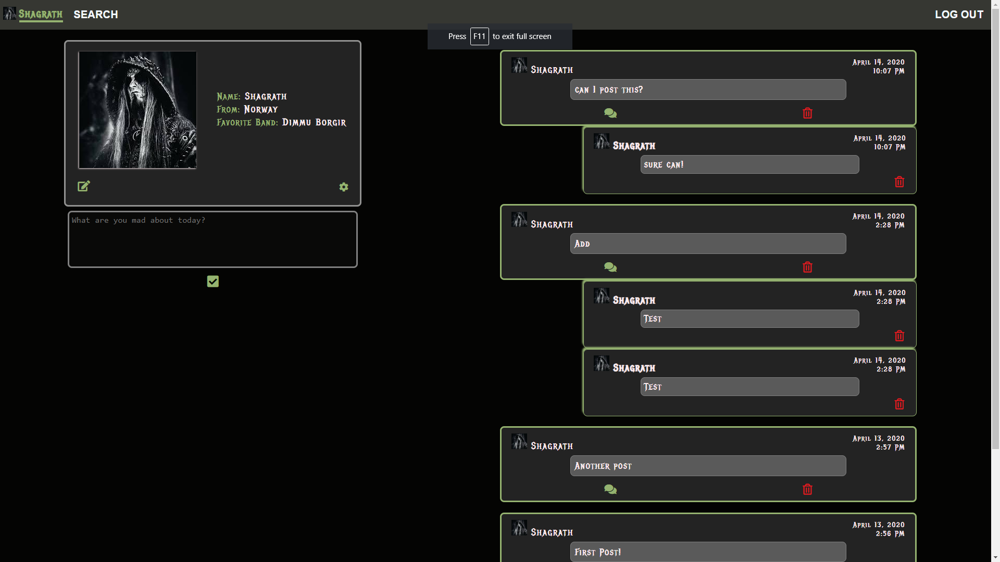
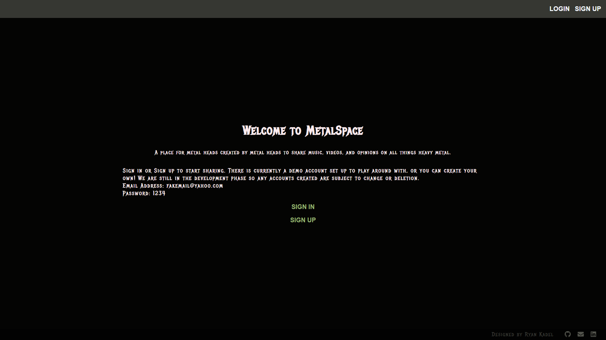
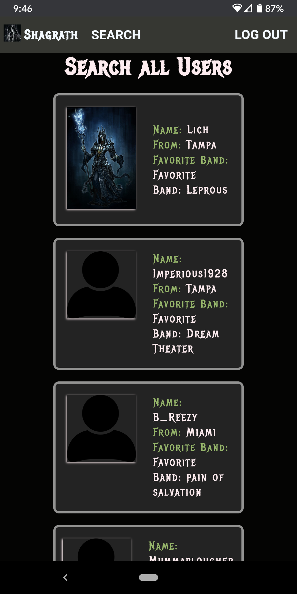

## MetalSpace - Social Media for Metal heads

### Available at https://metalspace.now.sh/
### Front end repo is available at https://github.com/r-kadel/metalspace

MetalSpace is a social media application for metal heads to engage with each other, talk about the bands they like, share opinions and complain about music in general (especially metal).

A user can sign up and log in to their account and is taken to their personal profile page. From there they can edit their personal information, add a profile picture, make posts (go on rants) and see other users comments on their rants. They can also do a search for other users and visit their pages and comment on their rants.

This is a full stack web application that uses React and custom vanilla CSS on the front end to deliver a fast and accessible user experience.
On the back end node.js using an express server handle the routing and API and and a postgresql database stores the users log in information. 
JWT is used to authenticate and validate users to ensure the security of our users personal information.

The API is powered by Heroku and is set up to take any CRUD requests from the client. The initial request is to log in and validate the client data against the user data stored in the postgresql database. If the request is sucessful and validated by the server a JWT token is sent to the client allowing them to access the main app and the other users/posts/comments endpoints. 

The API is built in node.js and is an express server. It uses knex to work with the postgresql database. bcryptjs is used to hash passwords and compare them on certain requests for user protection, and jsonwebtoken is used for authentication on the client end.

### API End Points Docs

  /api/auth

  This is the authentication route with only one endpoint, a user post request with credentials that are validated against the username and password stored on the server. If sucessful the server sends a 200 response code and a JWT to the client to validate access to the search endpoint
  
    post('/login')
        validates that the request has both a username and password sent in body
        then uses the bcryptjs compare functionality to compare the encrypted password stored on the database

        if the passwords match a JWT is created and returned to the client for access to the search end point 

        valid auth/login post example headers and body would look like:
              headers: {
                "Content-Type": "application/json",
                "Authorization": "bearer TOKEN_KEY"
              },
              body: {
                      "username": "user",
                      "password": "password"
              }

  /api/users

  The users end point is used internally to set up, edit, and get data from the database and is not for public use. It allows for adding users to the database, editing their information, deleting or viewing all of the stored users

  /api/users

   .route('/')
    .get('returns all users in the database)

    .post 
      requires a username password and email, verifies them, and then checks to make sure that the username isnt taken, encrypts the password with bcrypt.js and stores it to the database and returns(201), user can optionally include location and band data.

      headers required include the bearer token and the content type
      example: 
      {
        "Content-Type": "application/json",
        "Authorization": "bearer sometoken"
      }
      example post request body would  look like 
      {
	      "username": "admin",
	      "password": "1234",
	      "email": "cooldood@hotmail.com"
      }

  /api/users/:userId

  first checks to make sure user exists
  
    .route('/:user_id')
        .get(id) 
          gets the data for the user with the specified id from the requested ID in the endpoint and returns that user data

        .delete('/:userId') 
          deletes the user with the specified id from the requested ID in the endpoint
          and returns (204)

        .patch('/userId') 
          requires atleast one of the user data fields to be updated and if valid updates the field in the database and returns (204)
        example request:
        .patch('/5')
            {
	            "email": "newEmail@hotmail.com"
            }
          
  /api/posts

  The posts endpoint keeps track of all the posts made by any user. It handles all relevant CRUD actions that can be performed on any given post.

  .route('/)
    .get('Returns all posts')

    .post()
              requires only content and verifies that a logged in user with ID is making the request. The request is parsed and sent to the database and returns(201 then the post data is sent back to client.

      headers required include the bearer token and the content type
      example: 
      {
        "Content-Type": "application/json",
        "Authorization": "bearer sometoken"
      }
      example post request body would look like 
      {
	      "user_id": "1",
	      "content" : "this is my first rant"
      }

  .route('/posts/:postId)
    

  /api/comments

  The posts endpoint keeps track of all the comments made by any user. It handles all relevant CRUD actions that can be performed on any given comment.

  .route('/)
    .get('Returns all comments')

    .post()
              requires content and the post_id for the post the comment is associated with, and verifies that a logged in user with ID is making the request. The request is parsed and sent to the database and returns(201 then the comment data is sent back to client.

      headers required include the bearer token and the content type
      example: 
      {
        "Content-Type": "application/json",
        "Authorization": "bearer sometoken"
      }
      example post request body would look like 
      {
	      "user_id": "1",
          "post_id": "2",
	      "content" : "this is my first comment"
      }

 .route('/comments/:commentId)
  .all()
    verifies that the comment exists
  })

  .delete(requireAuth, (req, res, next) => {
    Simply verifies the auth and then deletes the comment given from the ID in params
  });